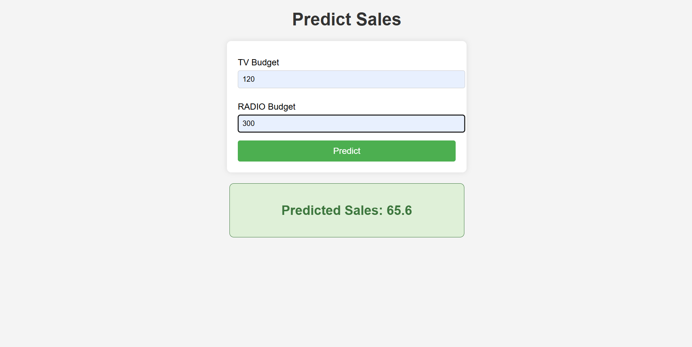

# 📈 Advertising Sales Predictor

This is a simple machine learning web application built using **Flask**. It predicts **sales revenue** (in thousands of dollars) based on advertising spending on **TV** and **Radio**.  

The model used is **Linear Regression**, trained on the classic Advertising dataset.

---

## 📊 Inputs and Outputs

| Feature | Description                         | Input Type | Expected Range |
|---------|-------------------------------------|------------|----------------|
| TV      | Budget spent on TV ads (in $1000s)  | float      | e.g., 0–300    |
| Radio   | Budget spent on Radio ads (in $1000s)| float     | e.g., 0–50     |

➡️ **Output:**  
The predicted **Sales** is also in **thousands of dollars**, calculated using the input budget values.

**Example:**  
If you enter:  
- TV = 120  
- Radio = 300  

The model may predict:  
**Predicted Sales: 65.6** (i.e., approx $65,600)

---

## ⚙️ Technologies Used

- Python
- Flask (for web framework)
- HTML/CSS (for frontend)
- scikit-learn (for model)
- joblib (to save/load model)
- Render (for free deployment)

